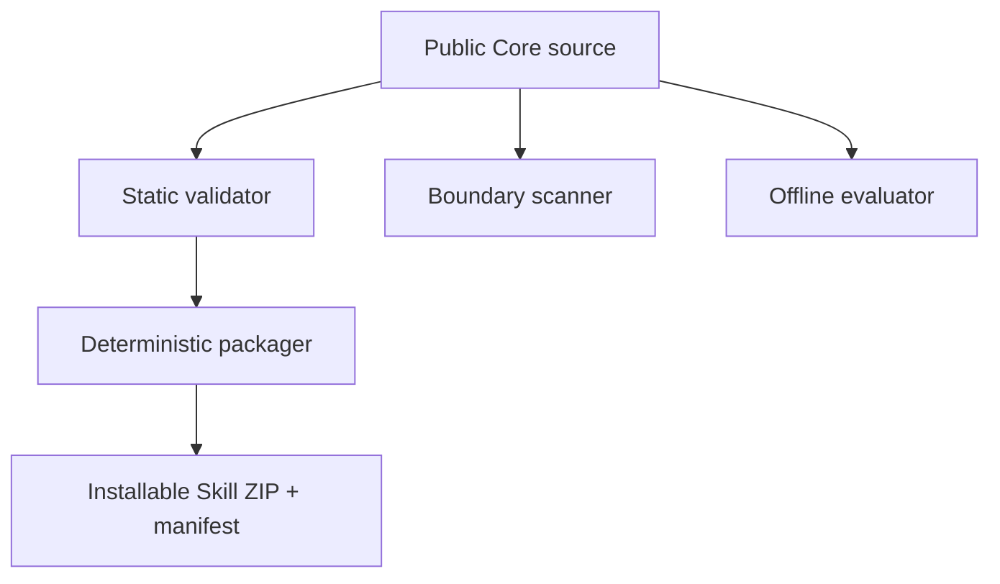

# Architecture

## Source repository and installed Skill

The source repository is the governance and development surface. It contains
the installable source at `skills/clinical-data-research-navigator/`, validation
scripts, tests, documentation, and packaging tools. Packaging produces a
minimal ZIP; installation expands that ZIP into a user-selected destination as
the installed Skill. Repository tests can run against the source Skill without
performing an installation.

## Public Core and private Adapter

The public Core defines reusable authority routing, evidence records, data
contracts, code-maturity gates, and synthetic examples. An externally mounted,
private Adapter supplies institution-specific, governed metadata only in its
approved environment. The Core must not read, copy, or infer private Adapter
values. If an Adapter, live metadata verification, or fixtures are absent, the
result remains `SPECIFICATION ONLY — NOT EXECUTABLE`.

## Validation and packaging flow

The static validator, boundary scanner, and evaluator are independent verification gates.
The static validator checks Skill structure and metadata; the boundary scanner
checks the repository for prohibited private material and likely secrets; and
the evaluator applies the repository's offline rubric to supplied responses.
For packaging, only validator is the packager's direct dependency: the packager
validates the Skill and creates a deterministic archive plus manifest.
Producing a ZIP does not imply that the boundary scan or evaluator passed; run
those gates separately before accepting or distributing an artifact.

CI is credential-free. Dependency acquisition can use public package and
GitHub services to check out source, configure Python, and install the declared
dependencies. After dependency acquisition, validation makes no institutional
or external LLM network calls. The read-only repository token is sufficient
for checkout and validation; the workflow receives no project secrets.

## Release trust boundary

The validation workflow runs the same four-command verification set on Ubuntu
and Windows with read-only repository permissions. The manually dispatched
release workflow checks an existing annotated, version-matched tag that is
reachable from `origin/main`, repeats both platform jobs against that tag, and
grants `contents: write` only to the dependent publish job. The publish job
rebuilds and verifies the deterministic ZIP and manifest before creating a new
Release; it cannot edit an existing Release.
