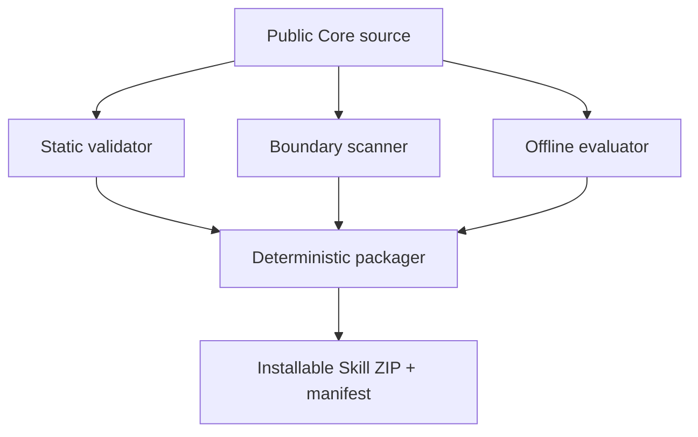

# Architecture

## Source repository and installed Skill

The source repository is the governance and development surface. It contains
the installable source at `skills/clinical-data-research-navigator/`, validation
scripts, tests, documentation, and packaging tools. Packaging produces a
minimal ZIP; installation expands that ZIP into a user-selected destination as
the installed Skill. Repository tests can run against the source Skill without
performing an installation.

## Public Core and private Adapter

The public Core defines reusable authority routing, evidence records, data
contracts, code-maturity gates, and synthetic examples. An externally mounted,
private Adapter supplies institution-specific, governed metadata only in its
approved environment. The Core must not read, copy, or infer private Adapter
values. If an Adapter, live metadata verification, or fixtures are absent, the
result remains `SPECIFICATION ONLY — NOT EXECUTABLE`.

## Validation and packaging flow

The static validator checks Skill structure and metadata. The boundary scanner
checks the repository for prohibited private material and likely secrets. The
evaluator applies the repository's offline rubric to supplied responses. The
packager validates the Skill and creates a deterministic archive plus manifest.

CI is offline and credential-free so it cannot access institutional systems,
download protected documents, call an external LLM, or expose repository
secrets. Its read-only token is sufficient for checkout and validation only.
