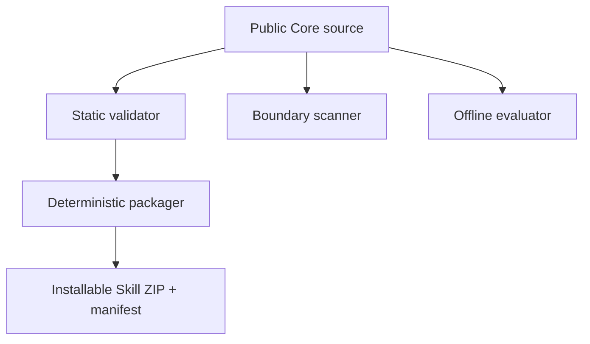
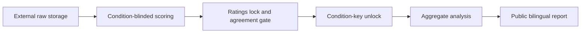

# Architecture

## Source repository and installed Skill

The source repository is the governance and development surface. It contains
the installable source at `skills/clin-nav/`, validation
scripts, tests, documentation, and packaging tools. Packaging produces a
minimal ZIP; installation expands that ZIP into a user-selected destination as
the installed Skill. Repository tests can run against the source Skill without
performing an installation.

## Public Core and private Adapter

The public Core defines reusable authority routing, evidence records, data
contracts, code-maturity gates, and synthetic examples. An externally mounted,
private Adapter supplies institution-specific, governed metadata only in its
approved environment. The Core must not read, copy, or infer private Adapter
values. If an Adapter, live metadata verification, or fixtures are absent, the
result remains `SPECIFICATION ONLY — NOT EXECUTABLE`.

## Validation and packaging flow

The static validator, boundary scanner, and evaluator are independent verification gates.
The static validator checks Skill structure and metadata; the boundary scanner
checks the repository for prohibited private material and likely secrets; and
the evaluator applies the repository's offline rubric to supplied responses.
For packaging, only validator is the packager's direct dependency: the packager
validates the Skill and creates a deterministic archive plus manifest.
Before hashing and archiving, it canonicalizes CRLF and CR to LF for files
that are valid UTF-8 text and contain no NUL byte. Opaque or binary files keep
their original bytes when they contain a NUL byte or are not valid UTF-8.
Manifest file hashes and sizes describe these canonical archive bytes, so a
Windows or POSIX checkout does not change a text file's packaged representation.
Producing a ZIP does not imply that the boundary scan or evaluator passed; run
those gates separately before accepting or distributing an artifact.

## Independent effectiveness-evaluation flow

The [effectiveness evaluation framework](../evals/effectiveness/README.md) is
independent from the existing deterministic response-contract Evals. It uses
synthetic tasks and external study inputs to evaluate product task performance;
it does not change the response-contract gate or turn an exploratory pilot into
clinical-validity evidence.

Assignment rows, human answers, blinded scores, ratings locks, condition keys,
and consent material stay outside the checkout. Only a validated anonymous
aggregate may enter the public reporting flow. There is no external model call in CI,
and packaging the Skill does not include effectiveness raw data or run a human study.

CI is credential-free. Dependency acquisition can use public package and
GitHub services to check out source, configure Python, and install the declared
dependencies. After dependency acquisition, validation makes no institutional
or external LLM network calls. The read-only repository token is sufficient
for checkout and validation; the workflow receives no project secrets.

## Release trust boundary

The validation workflow runs the same four-command verification set on Ubuntu
and Windows with read-only repository permissions. The manually dispatched
release workflow checks an existing annotated, version-matched tag that is
reachable from `origin/main` and repeats both platform jobs against its pinned
commit. A read-only build job creates and verifies the deterministic ZIP,
manifest, static Release notes, and transit checksum file, then uploads that
bundle under an immutable artifact ID. Only the dependent writer job has
`contents: write`; it has no source checkout, Python setup, dependency install,
or repository code execution. It downloads the verified bundle, checks both
the checksum-file digest and every bundled file, immediately rechecks the
remote annotated tag object, peeled commit, and absence of an existing Release,
then creates a new Release. It cannot edit an existing Release.
