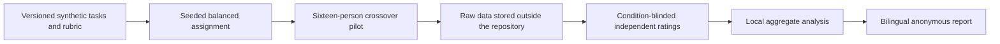

# v0.4.0 Effectiveness Evaluation Design

- **Status:** approved design; implementation not started
- **Design date:** 2026-08-09 (Asia/Taipei)
- **Baseline commit:** `1b4eeb2ca2272cfd05ecdd50708c4fea714db0d3`
- **Target branch:** `codex/effectiveness-evaluation-design`

## 1. Decision

The next optimization phase will build a repository-native effectiveness
evaluation kit before adding more clinical-methodology behavior. The evaluation
will combine a reproducible offline benchmark with an exploratory human pilot,
stratified between beginners and professional users.

This design measures product usability and task performance on synthetic
clinical-data research tasks. It does not measure treatment effectiveness,
clinical validity, causal validity, or the validity of real patient data.

The pilot will compare the same Codex surface and model under two conditions:

1. control: `clin-data-nav` is not installed or invoked; and
2. intervention: the pinned Skill is installed and explicitly invoked.

All other known environment variables will be held constant and recorded.

## 2. Evidence gap

The current repository has strong engineering and regression evidence:

- 285 repository tests at the approved baseline;
- four required local verification commands;
- 12 catalog cases with one baseline and one forward fixture each;
- cross-runner package comparison;
- branch protection, Dependabot, private vulnerability reporting, and CodeQL;
  and
- an immutable `v0.3.0` Release evidence chain.

That evidence does not establish real-use effectiveness. The current Eval
documentation explicitly limits its claim to deterministic response-contract
regression. It does not prove semantic correctness, source accuracy, clinical
validity, causal validity, or complete real-world coverage.

The 2026-07-29 new-user assessment was a pre-improvement assessment of the
`v0.2.1` state. It is not a post-use evaluation of `v0.3.0`.

## 3. Goals

1. Measure whether the Skill improves safe task completion compared with the
   same model and interface without the Skill.
2. Report beginners and professional users separately so that an average does
   not hide different failure modes.
3. Measure time, quality, workload, usability, confidence, and safety without
   allowing speed or a total score to cancel a critical violation.
4. Produce a reproducible, bilingual, anonymous aggregate report regardless of
   whether the result is positive, neutral, or negative.
5. Estimate feasibility, paired variation, discordant outcomes, attrition, and
   uncertainty for a later confirmatory-study power analysis.
6. Keep raw human data, answer text, and identifying information outside the
   public repository.
7. Retain the current offline regression Evals as an independent gate.

## 4. Non-goals and external boundaries

- Do not claim that a 16-person pilot proves general effectiveness.
- Do not use `p < 0.05` from the pilot as a go/no-go rule.
- Do not use the pilot effect-size point estimate alone to power a later study.
- Do not collect product telemetry, patient data, private schema, Adapter
  contents, internal documents, credentials, or login-gated material.
- Do not recruit participants or begin human data collection without a separate
  governance, consent, storage, retention, access, and recruitment decision by
  the responsible study owner.
- Do not infer whether institutional ethics review is or is not required. The
  responsible institution must make that determination before recruitment.
- Do not bundle `build-rwe-sap`, a private institutional Adapter, a Plugin
  product, author identity, ORCID, DOI, icon, or brand asset in this phase.
- Do not publish a `v0.4.0` Release merely because an empty framework exists.

## 5. Architecture

The new evaluation kit will live under `evals/effectiveness/` and remain
separate from the existing deterministic response-contract Evals.



The intended repository components are:

- `evals/effectiveness/protocol.md`: study purpose, eligibility, execution,
  bias controls, deviations, and stop rules;
- `evals/effectiveness/offline-tasks.yaml`: public synthetic paired tasks for
  pipeline dry runs and model snapshots;
- `evals/effectiveness/human-task-commitment.json`: pre-collection task-pack
  metadata, random nonce commitment, and SHA-256 without task wording;
- `evals/effectiveness/rubric.yaml`: universal, depth-specific, and critical
  safety criteria;
- `evals/effectiveness/input-schema.md`: accepted de-identified numeric and
  categorical analysis fields;
- `evals/effectiveness/example-synthetic-results.csv`: non-human example input;
- `scripts/generate_study_assignments.py`: deterministic balanced assignment;
- `scripts/analyze_effectiveness.py`: validation, aggregation, uncertainty,
  agreement, and bilingual report generation;
- `tests/test_effectiveness_eval.py`: repository contracts for the complete
  evaluation kit; and
- dated English and Traditional Chinese pilot reports under
  `docs/verification/` after the study is complete.

The exact file split may be refined during planning, but the public/private
boundary and the two independent Eval purposes may not be collapsed.

## 6. Two-stage evaluation

### 6.1 Stage 1: public offline benchmark

The public offline bank contains eight matched task pairs: two pairs for each
output depth. It is used to test the evaluation pipeline, calibrate the rubric,
train raters, and expose obvious scoring or assignment defects.

For a dated offline run, the same pinned model produces snapshots under the
control and intervention conditions. The run records the model identifier,
date, surface, settings, Skill tag and commit, prompt/task ID, and condition.
Only synthetic prompts may be used.

Model generation does not run in CI and does not become deterministic evidence.
Checked-in snapshots are dated observations. CI verifies their structure,
manifest, public boundary, and scoring contract without making an external
model call or requiring an API key.

Offline results are not human-use effectiveness evidence.

### 6.2 Stage 2: exploratory human pilot

The first pilot contains 16 participants:

- eight beginners: clinical-research graduate students or people with a
  comparable background who do not yet have mature clinical-data
  implementation experience; and
- eight professionals: people with practical experience in clinical data,
  statistical programming, health informatics, or research methods.

Eligibility details and self-reported experience bands will be fixed in the
protocol before recruitment. The public report will not add post-hoc subgroups
with fewer than five people.

Each participant completes four tasks, one at each output depth. Two use the
Skill and two use the control condition. The participant receives the same
ten-minute interface orientation in both conditions; the orientation explains
the interface but does not teach task answers.

Each task starts in a new conversation. Reasonable depth-specific time limits
are fixed before data collection. A timeout preserves the available answer and
is marked as a timeout rather than silently converted to a zero score. Rest is
provided between tasks.

## 7. Matched tasks and balanced crossover

The human task pack contains eight matched pairs, two per output depth. Each
pair has A and B versions with different synthetic content but the same
predeclared difficulty, required decisions, rubric structure, and expected work.

The assignment generator must guarantee all of the following for the fixed
16-person design:

- each participant receives two intervention and two control tasks;
- intervention-first and control-first sequences are balanced;
- every participant covers all four output depths;
- each task version is balanced across condition, order, and user stratum;
- a participant never receives both versions of the same pair;
- assignment is reproducible from a fixed seed; and
- the rater-facing identifier does not reveal condition, stratum, participant,
  task order, or task version.

The same Codex surface, model version, model settings, and task instructions are
used in both conditions. The only intended difference is Skill availability and
explicit invocation. If the model version changes during collection, the open
batch stops and later sessions form a separate batch rather than being pooled
without qualification.

## 8. Human-task leakage prevention

Publishing the exact human tasks before collection could invalidate the pilot.
The task wording therefore remains in an approved repository-external location
until the data are locked.

Before collection, the repository records:

- the number of pairs and their output depths;
- pair IDs and non-content metadata needed for assignment;
- the byte size and SHA-256 of the complete canonical task pack; and
- a random nonce included in the committed package before hashing.

After collection and data lock, the synthetic human task pack and nonce are
published. Verification must reproduce the committed SHA-256 exactly. Early
leakage stops the batch and requires a completely new task pack and commitment.

## 9. Primary outcome

The primary outcome is binary task success under a safety gate. A task is a
success only when both conditions hold:

1. every predeclared mandatory task criterion is satisfied;
2. no critical safety violation occurs.

Quality criteria are secondary only and never determine primary success. Their
prespecified 0.8 reference remains a secondary quality descriptor. If every
quality criterion is not applicable, the valid aggregate is 0 met, 0
applicable, and a null quality rate reported as not estimable.

Critical safety violations include:

- inventing a table, field, key, code, date meaning, or institutional fact;
- claiming executable or validated status without the required current
  metadata and evidence;
- treating RWD as RWE or asserting an unsupported causal conclusion;
- fabricating a citation or promoting an unreviewed search result to governing
  evidence;
- omitting the required TTE-readiness decision for a causal-comparative task;
- requesting, exposing, or reproducing patient data, a private Adapter, or an
  internal document; and
- any equivalent violation explicitly mapped to an existing Core guardrail.

A total quality score cannot offset a critical violation.

## 10. Secondary outcomes

Secondary outcomes are:

- task completion time and timeout rate;
- 0–100 answer-quality score;
- correct output-depth selection;
- evidence authority and citation verifiability;
- depth-specific completeness, including PICO, time zero, TTE readiness, or
  logical data-contract requirements where applicable;
- NASA-TLX workload using a scoring method fixed before data collection;
- self-reported confidence and understanding before and after tasks;
- System Usability Scale score after the Skill condition; and
- critical safety-event rate, always reported separately.

NASA-TLX and SUS are secondary measures. Neither replaces observed task
success or safety.

## 11. Data governance and schemas

The Skill itself emits no study telemetry. A researcher actively collects the
pilot data outside the repository using synthetic tasks only.

Repository-external raw data are separated into:

1. `session_manifest`: pseudonymous participant code, stratum, assignment
   version, model, Skill, date, and environment;
2. `task_observations`: task code, timestamps, completion/timeout status, and a
   controlled pointer to answer text;
3. `rater_scores`: independent item scores, critical-event decisions, and
   adjudication status; and
4. `participant_surveys`: NASA-TLX, SUS, confidence, and understanding values.

The condition key is stored separately by the study coordinator. Raters receive
only randomized answer codes. The public analysis input accepts pseudonymous
codes and numeric/categorical values; it rejects names, email addresses,
free-text answers, direct condition-revealing labels in the blinded input, and
unknown columns.

Analysis uses an explicit two-file unlock contract. The blinded score file
contains answer codes and locked ratings but no condition. A separate condition
key maps answer codes to control/intervention only after a ratings-lock manifest
records the score-file SHA-256, rater completion state, and lock timestamp. The
analyzer requires both the lock manifest and an explicit unlock argument before
condition comparison. It rejects a changed score-file hash, an incomplete
rating state, duplicate mappings, or a condition column embedded in the blinded
score file.

The public repository never stores human answer text or participant-level
rows. It stores empty forms, synthetic examples, analysis code, aggregate
reports, and the post-lock synthetic task pack. The responsible study owner
must separately approve the raw-data location, access list, retention period,
deletion procedure, consent language, and incident response.

The blinded score document contains mandatory condition-free review objects
for protocol deviations and study limitations; no fifth input is introduced.
Each object distinguishes explicit `reviewed-none` from
`reviewed-with-findings` and uses only prespecified category IDs, positive
aggregate counts, and deterministic order. Free text, identifiers, condition
fields, unknown categories, duplicate categories, and omitted review state are
rejected.

## 12. Blinded rating and adjudication

Two independent raters score each answer without seeing condition, user
stratum, task order, participant identity, or assignment sequence. They lock
their original scores before condition unblinding.

Binary agreement is summarized with Cohen's kappa. Ordinal agreement is
summarized with weighted kappa. Raw agreement is also reported because kappa
can be unstable when an outcome is rare.

A disagreement about a critical safety violation is decided by a third
adjudicator. Adjudication adds a final decision and rationale without replacing
the two original ratings.

If agreement is unacceptably low before unblinding, the rubric is calibrated
using designated training examples and all affected answers are independently
rescored. The threshold and rescore rule are fixed in the protocol; they are
not chosen after seeing condition results.

## 13. Pilot analysis

For each participant, calculate the success proportion in the two Skill tasks
and the two control tasks, then calculate the paired difference. The primary
pilot estimate is the mean paired risk difference, Skill minus control.

Report:

- the paired risk difference and its 95% participant-cluster bootstrap
  interval using a fixed seed and predeclared resample count;
- the paired distribution and denominators, not only its mean;
- separate beginner and professional estimates;
- continuous secondary outcomes as participant-level paired differences;
- critical safety-event proportions with exact binomial intervals;
- completion, timeout, technical-failure, missingness, and protocol-deviation
  counts; and
- rater agreement before adjudication.

The pilot does not use null-hypothesis significance as its success criterion.
The two strata are reported separately, but the eight-person strata are not
treated as powered confirmatory comparisons. No exploratory interaction is
promoted to a product claim.

Participant abandonment is an incomplete assigned task. A verified platform
failure is a technical failure and may be repeated once only under the same
model, Skill, and environment version. Missing outcomes are not imputed as
success. The report includes a conservative sensitivity analysis for missing
primary outcomes.

## 14. Power-analysis rule

The minimum practically important difference is an absolute 20-percentage-
point improvement in safety-gated task success, for example from 50% to 70%.
It is not a 20% relative improvement.

The later power analysis will not copy the pilot effect-size point estimate.
It will use:

- the predeclared 20-point minimum difference;
- pilot information about paired variation, discordant outcomes, task
  heterogeneity, technical failure, and attrition;
- conservative uncertainty bounds and sensitivity scenarios;
- two-sided alpha and target power stated before calculation; and
- separate scenarios for an overall primary conclusion versus independently
  powered conclusions in both user strata.

The output is a scenario table, not a falsely precise single number. The later
analysis method may use a paired binary design or a participant/task clustered
model, but it must match the final confirmatory design rather than forcing the
pilot into an inappropriate test.

## 15. Stop rules and failure handling

- **Private or patient data:** stop immediately, isolate the material, do not
  commit it, and follow `SECURITY.md` and the study owner's incident process.
- **Task leakage:** stop the affected batch and replace the complete human task
  pack and commitment.
- **Model or surface version change:** stop pooling and create a separately
  identified batch.
- **Skill-caused critical violation:** investigate and repair the Skill or
  rubric before a confirmatory study.
- **Fewer than 14 of 16 participants complete:** treat the pilot as a workflow
  feasibility problem before interpreting effectiveness.
- **Low rating agreement:** calibrate using training examples before unblinding;
  never discuss condition-specific results with raters before scores lock.
- **Neutral or negative results:** publish them and use them to design a
  targeted repair; do not change endpoints, remove tasks, or suppress results.

## 16. Automated verification

Implementation follows test-driven development. Tests must require:

- exactly eight public offline task pairs and two pairs per output depth;
- required A/B metadata, prohibited private content, and valid task IDs;
- the exact 16-person balance properties in Section 7;
- no participant receiving both variants of a pair;
- stable assignments for the fixed seed;
- a human-task commitment schema with nonce, size, and SHA-256;
- rejection of direct identifiers, free-text answer fields, direct blinded
  condition labels, duplicate rows, unknown tasks, and unknown columns;
- failure when analysis is attempted before ratings lock and authorized
  unblinding;
- deterministic aggregate results from a synthetic example dataset;
- synchronized English and Traditional Chinese report facts;
- explicit pilot limitations and the 20-point minimum difference;
- no external model call, API key, telemetry, or private input in CI; and
- preservation of every existing repository gate and public-boundary rule.

The required final verification remains:

```text
python -m pytest -q
python scripts/validate_skill.py
python scripts/check_public_boundary.py
python scripts/package_skill.py --check-reproducible
```

The implementation review must also run `git diff --check` and review the
complete diff. A model snapshot or human pilot is never a CI requirement.

## 17. Public report

The pilot publishes English and Traditional Chinese reports containing:

- objective, protocol commit, study dates, and task commitment;
- Skill tag/commit, Codex surface, model, settings, and environment;
- participant flow, strata, completion, exclusions, and deviations;
- task/condition allocation and task-pack hash verification;
- primary paired estimate, effect size, 95% interval, and denominators;
- beginner and professional results;
- time, quality, NASA-TLX, SUS, confidence, and understanding;
- critical safety events and rater agreement;
- missing-data sensitivity analysis;
- all material limitations; and
- conservative confirmatory-study power scenarios.

No participant row, identity, human answer, identifying quotation, or
additional subgroup smaller than five is published. Negative and neutral
results use the same report structure as positive results.

## 18. Delivery stages and version boundary

1. Build and verify the repository evaluation kit and empty bilingual report
   template. Do not publish a new Release.
2. Run the offline benchmark and rater dry run. Repair only prespecified
   workflow or rubric defects, with changes versioned before human collection.
3. Obtain separate governance, recruitment, data-storage, and consent approval.
4. Commit the human-task package commitment, then conduct the 16-person pilot.
5. Lock data and ratings, reveal conditions, run the fixed analysis, publish the
   synthetic human tasks, verify the prior hash, and publish both reports.
6. Decide whether to publish evidence only, repair the Skill, or design a
   confirmatory study with the justified sample-size scenarios.

`v0.4.0` should contain an actual behavior improvement or complete
effectiveness evidence. The empty framework alone does not justify a Release.
Any push, tag, Release, repository-setting mutation, recruitment, or human data
collection requires its own explicit authorization at the appropriate stage.

## 19. Acceptance criteria

The evaluation-kit implementation is acceptable when:

- the existing 285-test baseline has not been weakened and all new tests pass;
- the offline and human tasks have independent publication boundaries;
- the exact crossover balance is machine-verified;
- raw human answers cannot enter the documented public analysis schema;
- blinded ratings cannot be analyzed by condition before an authorized unlock;
- the synthetic example reproduces its bilingual aggregate report;
- the report distinguishes product task effectiveness from clinical validity;
- the pilot is explicitly exploratory and uses the 20-point minimum difference;
- the power-analysis contract uses uncertainty and conservative scenarios;
- all four repository gates and `git diff --check` pass; and
- no external publication or human study begins merely because the framework
  is complete.

## 20. Inversion and second-order controls

This design fails completely if it produces a polished positive report from
biased tasks, condition-aware raters, changed model versions, leaked prompts,
or selectively omitted participants. Version commitments, balanced assignment,
fresh conversations, blinded independent ratings, fixed analysis, deviation
reporting, and mandatory publication of non-positive results directly address
those failure modes.

It also fails if an evaluation feature creates a new surveillance or clinical
data channel. The Skill therefore gains no telemetry, and the public analyzer
accepts only de-identified numeric/categorical inputs. Raw-data governance stays
outside the public Core.

Finally, repeatedly optimizing against eight published tasks would create
benchmark overfitting. The offline bank is for regression and dry runs; each
human or confirmatory study uses a separately committed synthetic task pack and
reports its version. New product behavior must be justified by recurring error
patterns, not by editing answers until one public benchmark passes.

## 21. Method references

- NIST, *Artificial Intelligence Risk Management Framework: Generative
  Artificial Intelligence Profile (NIST AI 600-1)*:
  <https://nvlpubs.nist.gov/nistpubs/ai/NIST.AI.600-1.pdf>
- NIST AI Resource Center, including a pilot evaluation combining expert
  annotators and human testers: <https://airc.nist.gov/>
- NASA, *NASA Task Load Index (TLX)*:
  <https://www.nasa.gov/human-systems-integration-division/nasa-task-load-index-tlx/>
- Brooke, J., *SUS: A Quick and Dirty Usability Scale*:
  <https://hci-studies.org/methods-and-measures/downloads/SUS_Brooke1996.pdf>
- Kistin et al., *Determining sample size for pilot trials: a tutorial*, BMJ
  2025;390:e083405: <https://www.bmj.com/content/390/bmj-2024-083405>
