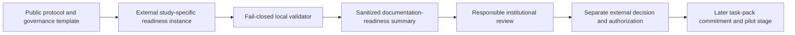

# Effectiveness Governance Readiness Pack Design

- **Status:** approved direction; written specification awaiting review
- **Design date:** 2026-08-11 (Asia/Taipei)
- **Baseline commit:** `3d60e71a0df7dc01fcf200022dd1610119fcf901`
- **Target branch:** `codex/effectiveness-governance-readiness-design`

## 1. Decision

The next effectiveness-evaluation stage will add a public, machine-checkable,
fail-closed governance readiness pack before any human-pilot activity. The pack
helps a responsible institution determine whether the proposed 16-person
exploratory pilot is documented well enough to enter institutional review. It
does not determine an ethics pathway, approve a study, authorize recruitment,
or replace IRB, REC, legal, privacy, data-owner, or institutional review.

The public repository will contain only templates, synthetic examples,
validators, and human-readable instructions. Any completed study-specific
readiness instance, evidence reference, responsible-person assignment,
institutional determination, storage location, consent material, recruitment
material, incident record, or confidential task-pack information remains in an
approved repository-external location.

## 2. Current evidence and gap

The repository already has:

- a fixed exploratory protocol for eight beginners and eight professionals;
- a validated 16-person, 64-task balanced assignment contract;
- external-path enforcement for study outputs;
- a confidential task-pack commitment mechanism;
- blinded agreement, ratings-lock, explicit unlock, and aggregate-only
  analysis contracts;
- an offline dry run recorded at baseline commit `3d60e71`; and
- explicit statements that no human pilot has been conducted.

The repository does not have a structured package for collecting the
pre-review decisions and evidence references required by delivery stage 3 of
the approved effectiveness design. The missing layer is documentation
readiness, not a new research method and not an institutional decision.

## 3. Goals

1. Make every pre-review governance topic explicit and fail closed when a
   required topic is undocumented.
2. Produce a sanitized readiness summary that cannot be mistaken for study
   authorization.
3. Keep all real institutional and study-specific references outside the
   public repository.
4. Reuse the existing external-path, deterministic-error, synthetic-example,
   and public-boundary patterns.
5. Provide aligned English and Taiwan Traditional Chinese instructions.
6. Prevent governance-document completion from starting recruitment,
   collection, task-pack commitment, rating, unlock, analysis, publication, or
   power analysis.

## 4. Non-goals and authority boundary

- Do not infer whether ethics review is required or which pathway applies.
- Do not represent a validator result as IRB, REC, legal, privacy, data-owner,
  or institutional approval.
- Do not create or store a real approval number, reviewer name, email address,
  institutional contact, file-system path, URL containing a secret, consent
  form, recruitment list, participant row, answer text, assignment file,
  ratings file, condition key, nonce, or confidential task pack.
- Do not create an actual human-task commitment or invoke an external model.
- Do not recruit, orient, train, consent, compensate, collect from, or score a
  human participant or rater.
- Do not calculate pilot effects or confirmatory sample size.
- Do not change the Skill response contract, package version, tag, Release,
  workflow permission, branch protection, or repository settings.
- Do not claim that documentation completeness establishes low risk, legal
  compliance, scientific validity, clinical validity, or real-use
  effectiveness.

## 5. Evaluated approaches

### 5.1 Documentation-only checklist

A single bilingual checklist is inexpensive but can drift from the protocol,
cannot reliably detect omitted controls, and cannot enforce external-path or
sanitized-output rules. It is rejected as the sole control.

### 5.2 Public pack plus fail-closed validator

This is the selected approach. Fixed controls, a closed JSON schema, external
instance enforcement, deterministic status calculation, synthetic examples,
and bilingual guidance make omissions visible while retaining human authority.

### 5.3 Private operational study package

A real operational package cannot be built safely without an identified study
owner, institutional pathway, approved storage, and authorized handling
environment. It is explicitly deferred and must never be reconstructed from
public placeholder values.

## 6. Architecture and files

The governance layer remains under the existing independent effectiveness
evaluation surface:



Planned public files are:

- `evals/effectiveness/governance/README.md`: English purpose, workflow,
  authority boundary, and command examples;
- `evals/effectiveness/governance/checklist.md`: English human-readable mapping
  of the 12 fixed controls;
- `evals/effectiveness/governance/checklist.zh-TW.md`: aligned Taiwan
  Traditional Chinese checklist;
- `evals/effectiveness/governance/readiness-template.json`: valid but wholly
  undocumented template whose calculated status is `incomplete`;
- `evals/effectiveness/governance/examples/synthetic-readiness.json`: a fully
  synthetic, documentation-complete example whose calculated status is
  `ready-for-institutional-review` and whose authorization state remains
  `not-authorized-to-recruit`;
- `scripts/governance_readiness.py`: closed-schema validation and deterministic
  summary construction;
- `scripts/validate_governance_readiness.py`: thin external-input CLI; and
- `tests/test_governance_readiness.py`: behavioral, mutation, path, and output
  boundary tests.

Implementation will make only the following minimal navigation or boundary
updates to existing files: `evals/effectiveness/README.md`, `.gitignore`,
`scripts/check_public_boundary.py`, `tests/test_public_boundary.py`, and
`tests/test_project_metadata.py`. `SKILL.md`, agent metadata, package version,
and Release material remain unchanged because the pack does not alter Skill
behavior.

## 7. Public template and external instance contract

### 7.1 Top-level object

The readiness object uses schema version string `"1"` and has exactly these
keys:

```json
{
  "schema_version": "1",
  "synthetic_example": false,
  "pack_id": "pilot-v1-governance",
  "protocol_commit": "0123456789abcdef0123456789abcdef01234567",
  "prepared_at": "2026-08-11T12:00:00+08:00",
  "controls": []
}
```

Requirements:

- `synthetic_example` is a JSON boolean;
- `pack_id` is an opaque identifier matching
  `[a-z0-9][a-z0-9._-]{2,63}`;
- `protocol_commit` is exactly 40 lowercase hexadecimal characters;
- `prepared_at` is a timezone-aware ISO 8601 timestamp; and
- `controls` contains the exact 12 rows below in the declared order.

The checked-in template uses `synthetic_example: false`, the current protocol
commit at implementation time, and all controls as `not-documented`. Its
pack ID and timestamp are non-operational public template metadata. Copying it
does not create a study record.

The checked-in example uses `synthetic_example: true`, synthetic reference
tokens, and no real institution, person, system, approval, or location.

### 7.2 Fixed control rows

Every control row has exactly:

```json
{
  "control_id": "study-owner-role",
  "documentation_status": "not-documented",
  "evidence_reference": null
}
```

`documentation_status` is exactly `not-documented` or `documented`.
`not-documented` requires a JSON null reference. `documented` requires an
opaque external evidence token matching
`[A-Za-z0-9][A-Za-z0-9._:-]{2,127}`. The token format deliberately rejects
whitespace, `@`, slash, and backslash so the public interface does not invite
names, emails, narrative text, URLs, or file-system paths. This syntax is not a
PII detector; the study owner remains responsible for ensuring every external
token is non-identifying and safe.

The exact ordered control IDs and meanings are:

1. `study-owner-role`: responsibility and escalation roles are assigned in an
   external controlled document;
2. `institutional-path-request`: the question and materials needed for the
   responsible institution to determine the ethics/governance path are
   prepared, without asserting its outcome;
3. `scope-risk-benefit`: purpose, synthetic-task boundary, participant burden,
   foreseeable risks, expected benefits, and nonclinical claim boundary are
   documented;
4. `external-storage`: the proposed approved repository-external raw-data and
   audit-storage surfaces are documented;
5. `access-minimization`: least-privilege roles, data minimization, separation
   of condition key, and access review are documented;
6. `retention-deletion`: retention period, deletion procedure, backup handling,
   and withdrawal handling are documented;
7. `consent-material`: consent language and participant information material
   are prepared for institutional review, not treated as approved;
8. `recruitment-plan`: eligibility, the two fixed strata, recruitment method,
   burden, compensation if any, and non-coercion controls are documented;
9. `incident-response`: privacy, task leakage, model/version change, platform
   failure, and safety-event escalation procedures are documented;
10. `environment-freeze`: Skill commit, model, surface, settings, Python,
    platform, batch/version stop rule, and manifest owner are documented;
11. `rater-readiness`: rater roles, blinding, synthetic training,
    agreement thresholds, recalibration, rescore, adjudication, and lock
    procedures are documented; and
12. `task-pack-commitment-plan`: confidential task-pack location, nonce and
    commitment custody, leakage stop rule, post-lock verification, and later
    publication authority are documented without creating the actual pack or
    commitment.

The validator rejects missing, duplicate, unknown, or reordered control IDs.
It does not accept institution-specific extension keys. Additional local
requirements belong in referenced external documents, not the public schema.

## 8. Status and authorization semantics

The library returns a sanitized summary with exactly:

```json
{
  "schema_version": "1",
  "status": "incomplete",
  "authorization": "not-authorized-to-recruit",
  "documented_controls": 0,
  "required_controls": 12,
  "missing_control_ids": ["study-owner-role"]
}
```

Status calculation is deterministic:

- `incomplete`: one or more required controls are `not-documented`;
- `ready-for-institutional-review`: all 12 controls are `documented` and the
  object is otherwise valid.

`authorization` is always the literal `not-authorized-to-recruit`. No input
field can change it. The schema contains no `approved`, `authorized`,
`review-not-required`, `exempt`, `IRB`, `REC`, `ready-to-recruit`, or equivalent
outcome field. An institutional decision is a later, external, human-governed
artifact and requires a new explicit project stage.

The summary prints only generic control IDs and counts. It never prints
`pack_id`, `protocol_commit`, timestamp, evidence tokens, input path, rejected
values, or traceback content.

## 9. Library and CLI behavior

The library interface is:

```python
validate_governance_readiness(payload: object) -> list[str]
summarize_governance_readiness(payload: dict) -> dict
```

Validation uses immutable allowed-key sets, explicit scalar-type checks, and
deterministically ordered errors. JSON booleans never pass integer or string
checks. The summary function validates again and raises a content-free
`ValueError("invalid governance readiness input")` rather than exposing a
rejected value.

The CLI is:

```text
python scripts/validate_governance_readiness.py --input <external-dir>/governance-readiness.json
```

It applies the existing `ensure_external_path` boundary before reading the
input and writes the sanitized canonical summary to standard output. It makes
no network call and writes no output file.

Exit codes are:

- `0`: valid and `ready-for-institutional-review`;
- `2`: invalid CLI usage, repository-internal input, unreadable JSON, or schema
  error; standard error contains only `governance readiness validation failed`;
- `3`: valid schema but `incomplete`; the sanitized summary is still written.

The checked-in template and synthetic example are verified through the library
in CI. The external-only CLI never needs an exception for repository fixtures.

## 10. Public/private boundary

Add the conventional ignored root `study-governance/` and make the public
boundary scanner reject it as `private-study-data` without reading or printing
its contents. This root is only a defense against accidental local placement;
the documented default remains an approved location outside the complete
repository checkout.

The scanner does not attempt content-based detection of institution-specific
references elsewhere. Path enforcement, contributor instructions, scoped
staging, diff review, and the existing AGENTS policy remain required layers.

The public files must contain no real organization-specific decision, human
identity, institutional metadata, consent text, recruitment material, private
storage identifier, participant information, or confidential task content.

## 11. Bilingual documentation

English and Taiwan Traditional Chinese checklists use the same 12 canonical
control IDs in the same order. Each explains:

- what evidence should exist externally;
- who must decide it in the real workflow, expressed as a role rather than a
  named person;
- which action remains prohibited while the control is undocumented;
- that `ready-for-institutional-review` is documentation readiness only; and
- that the validator does not decide whether review is required or authorize
  recruitment.

The governance README links back to the fixed protocol, input schema,
offline-dry-run evidence, `SECURITY.md`, and the existing task-pack commitment
and blinded-analysis commands. It does not reproduce consent language or
provide legal advice.

## 12. Failure handling and stop rules

- **Invalid or incomplete readiness input:** do not begin institutional
  submission or any human activity from that package; correct documentation
  externally and rerun.
- **Institutional-path ambiguity:** preserve `not-authorized-to-recruit` and
  obtain a determination from the responsible institution; do not infer a
  pathway from the validator.
- **Private or identifying material in the checkout:** stop, isolate without
  printing content, do not commit, and follow `SECURITY.md` plus the study
  owner's incident process.
- **Changed protocol, Skill, model, surface, environment, storage, consent,
  recruitment, or rater plan:** invalidate affected references and rerun
  readiness review before later authorization.
- **Task leakage or premature commitment:** stop the affected batch; the
  existing complete-pack replacement rule applies.
- **A green summary presented as approval:** treat this as governance misuse,
  withdraw the claim, and obtain the actual external institutional decision.

## 13. Automated verification

Implementation follows RED -> GREEN -> REFACTOR. Tests must prove:

- the checked-in template is valid, incomplete, and not authorized;
- the synthetic example is valid and ready only for institutional review;
- all 12 literal control IDs are present exactly once and in order;
- changing any one documented control to `not-documented` makes the result
  incomplete;
- missing, duplicate, reordered, or unknown controls fail schema validation;
- extra keys, wrong scalar types, non-aware timestamps, uppercase/non-hex
  commits, malformed identifiers, and invalid reference tokens fail closed;
- `not-documented` with a reference and `documented` without one fail closed;
- invented `approved`, `authorized`, ethics-outcome, or recruitment-ready
  fields are rejected;
- authorization remains `not-authorized-to-recruit` for every valid input;
- the external CLI rejects repository-internal paths;
- CLI exit codes 0, 2, and 3 match the exact semantics above;
- stdout and stderr never expose evidence tokens, input paths, rejected values,
  or tracebacks;
- `study-governance/` is ignored and rejected without payload disclosure; and
- English and Traditional Chinese files retain the same canonical control IDs
  and stage boundary.

No test may derive its expected control list or summary from production
constants. Expected IDs, counts, status, and authorization are hand-written
literals. Mutation tests pressure-test each realistic weakening.

The final required verification remains:

```text
python -m pytest -q
python scripts/validate_skill.py
python scripts/check_public_boundary.py
python scripts/package_skill.py --check-reproducible
git diff --check
```

No external model, institutional system, private data, or network service is a
test dependency.

## 14. Delivery and authorization stages

1. Implement and verify the public template, synthetic example, validator,
   bilingual checklist, and public-boundary controls.
2. Publish no study-specific readiness instance; record only local synthetic
   implementation evidence if required.
3. Under separate authorization, assign a responsible study owner and create a
   completed readiness instance in approved external storage.
4. Present the external package to the responsible institution for its own
   ethics/governance determination.
5. Record that determination and any approval conditions externally. Do not
   add them to the public repository merely because the validator was green.
6. Seek a new explicit authorization before creating the real task pack,
   nonce, commitment, recruitment materials, assignments, or human data.

This implementation stops after stage 2. Commit, merge, push, tag, Release,
repository-setting changes, institutional submission, and every human-study
action remain separately authorized.

## 15. Acceptance criteria

The governance readiness pack is acceptable when:

- its status semantics cannot represent institutional approval or recruitment
  authorization;
- the public template is incomplete by construction;
- the synthetic example is visibly synthetic and remains unauthorized;
- every required governance topic from the existing protocol is represented;
- real instances are forced outside the repository;
- output is aggregate, deterministic, and content-free;
- bilingual guidance is aligned;
- accidental `study-governance/` content is blocked without being printed;
- all behavior has focused RED/GREEN evidence;
- all existing tests and four repository gates remain green; and
- the complete diff contains no human, institutional, private, or operational
  study content.

## 16. Inversion and second-order controls

The design fails most seriously if a green validator is used as a substitute
for institutional authority. A constant negative authorization, absence of an
approval field, explicit stage separation, bilingual warnings, and mutation
tests make that misuse visible.

It also fails if machine checking encourages real approval data or identities
to enter Git. External-path enforcement, opaque non-path reference tokens,
synthetic-only fixtures, ignored/private study roots, sanitized errors, and
complete diff review reduce that risk. These layers do not claim automatic PII
detection.

A checklist can create false confidence even when every item is documented.
The result therefore says only `ready-for-institutional-review`; scientific
validity, ethics pathway, legal sufficiency, operational security, and approval
conditions remain human decisions.

Finally, governance documents can become stale after a model, protocol, Skill,
storage, consent, recruitment, or rater-plan change. The pack binds the public
protocol commit, external evidence references must be revalidated after a
material change, and the later environment manifest retains its existing stop
rule.
